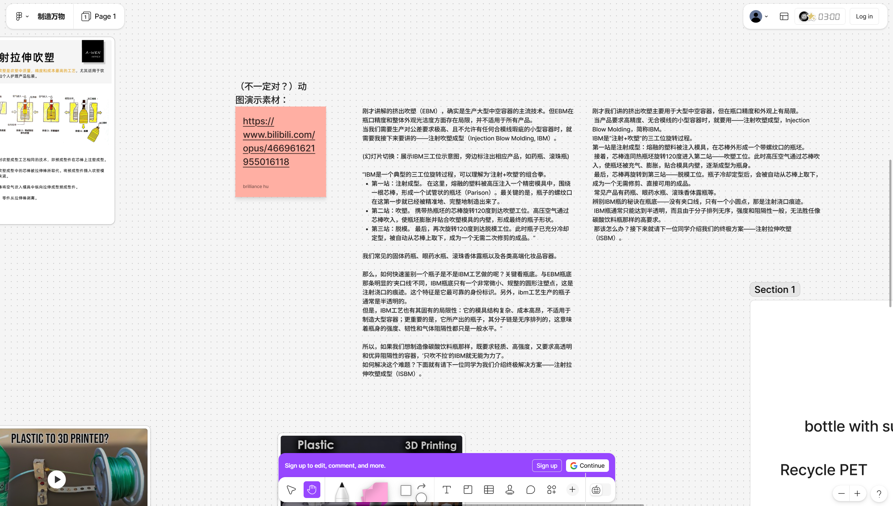
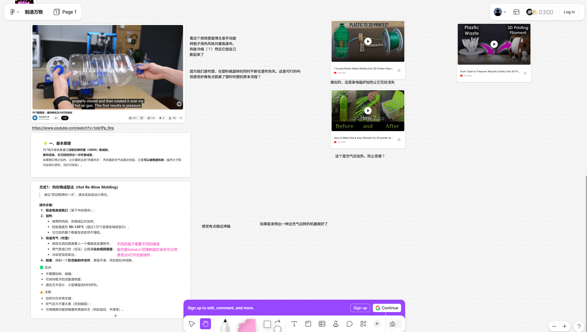
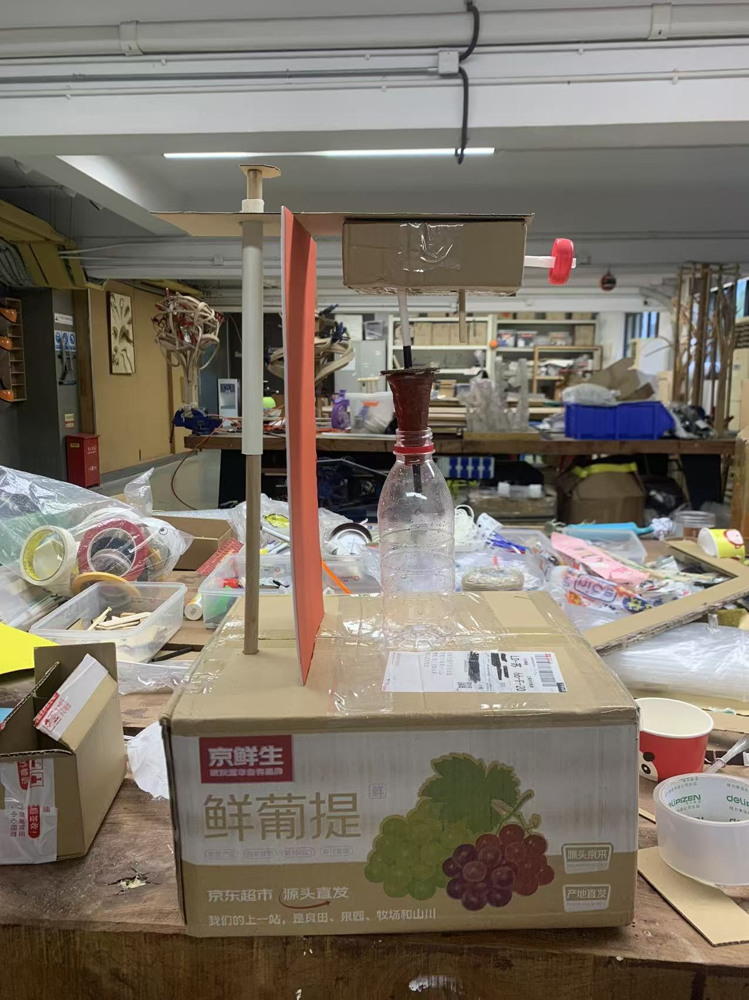
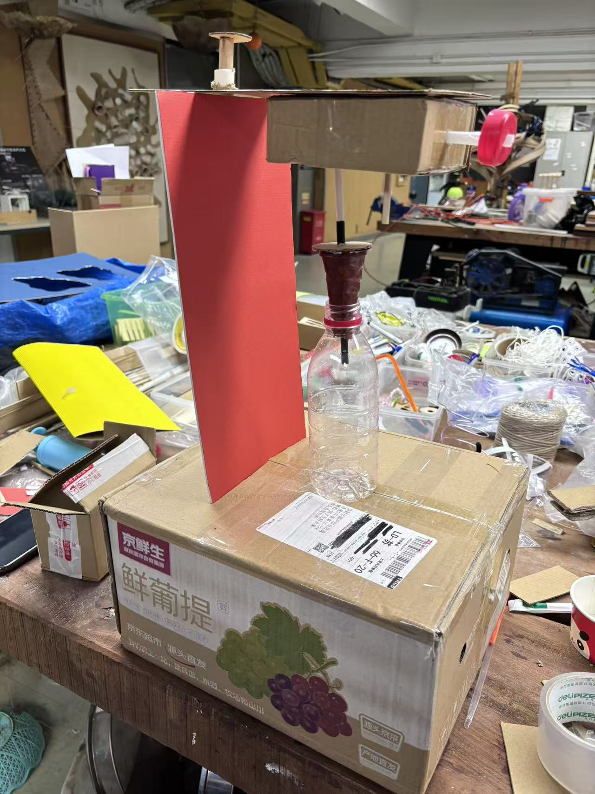
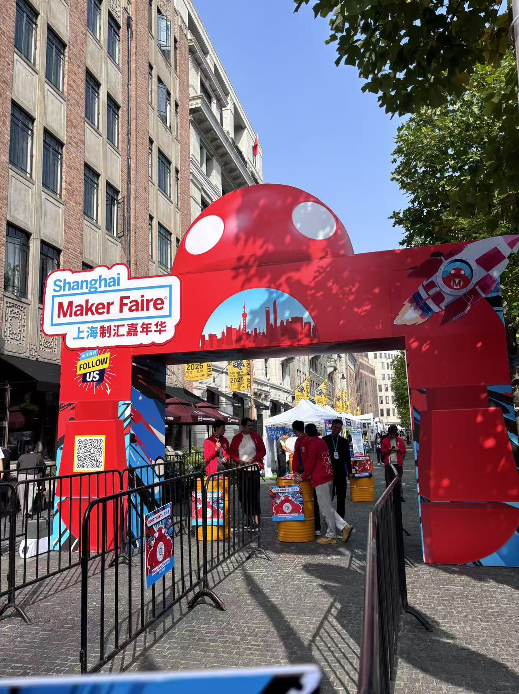

# Smoothblow-device-for-PET
## Project description
We imagine a device for smoothing PET bottles, therefore it can be used for 3d print filament.
Before we organized this concept, there were some initial attempts that introduced how this concept came to life. If you would like to read more, you can click the link below.

[前期尝试 Preliminary attempts](https://github.com/Red0tt/How-To-Make-Anything-/blob/main/WEEK-5-8_DEEPSICK/README.md)

## Preliminary attempts
### MAKE A RESEARCH (BLOW MOLDING)
Our team has selected the blow molding process as the subject of our study. We briefly reviewed this section in our "bible" (Manufacturing Processes for Design Professionals). We used various search engines (including Bing and Xiaohongshu) to search for relevant information and found that, overall, there are three main processes: EBM, IBM, and ISBM. After discussing and studying together in the group and on Figma, we decided that each person would be responsible for explaining one part. The specific content can be found in the following PDF.

我们的团队选择了吹塑工艺作为研究主题。我们在参考书《Manufacturing Processes for Design Professionals》中对这一部分进行了简要回顾。我们通过多个搜索引擎（包括 Bing 和小红书）查找了相关资料，发现总体上吹塑工艺主要分为三种类型：EBM、IBM 和 ISBM。经过在小组内以及 Figma 上的讨论与学习，我们决定由每个人分别负责讲解其中的一部分。具体内容见下方的 PDF。

[制造万物1021.pdf](https://github.com/user-attachments/files/23148710/1021.pdf)

### IMAGINE A NEW WAY
Later, the professor asked us to assume that this process is carried out in a Fablab, focusing on low-tech, small-scale modifications. At the beginning, we considered alternative solutions for every step of the blow molding process, such as using gel instead of PET, or a hairdryer instead of high-pressure air. The picture shows our detailed divergent thinking. 

后来，老师让我们假设这一工艺是在 Fablab 中完成的，重点关注低技术、小规模的改进。起初，我们针对吹塑工艺的每一个步骤都进行了替代方案的思考，例如用凝胶代替 PET，或用吹风机代替高压空气。图片展示了我们详细的发散性思考过程。

The professor told us that changing everything might be a bit difficult, and we only need to change one step. Based on our ideas, he also suggested that PET bottles could be used as 3D printing filament. But since the surfaces of the bottles are uneven, they need to be flattened before proceeding to the next step. We can use the re-blow molding process to make their surfaces flat.The main goal was to remove the imprints on the surfaces of different bottles. At that time, our idea was to use hot air and molds, so that the PET bottles would be heated by the hot air and conform to the molds, making them smooth.

老师告诉我们，完全更改整个流程可能有些困难，我们只需要改进其中的一个步骤。基于我们的想法，他还建议可以将 PET 瓶用作 3D 打印的丝材。但由于瓶子的表面不平整，在进入下一步之前需要先将其压平。我们可以利用“再吹塑（re-blow molding）”的方式使其表面变平。主要目标是去除不同瓶子表面的浮雕或纹理。当时我们的设想是使用热风和模具，让 PET 瓶在热风加热下贴合模具，从而使表面变得光滑。

However, the problem is that this would require molds for different bottle sizes, and some bottles are quite large, which would consume excessive resources. We tried to see how other bloggers were doing it, and after searching online with relevant keywords, we found that simply applying heat evenly could smooth the bottle’s surface.

然而，问题在于，这种方法需要为不同尺寸的瓶子制作模具，而有些瓶子体积较大，会消耗过多资源。我们尝试了解其他博主是如何处理的，在用相关关键词进行网络搜索后发现，只要对瓶身进行均匀加热，就能使其表面变得光滑。

Thus, we came up with an idea for a simple device:

因此，我们想到了一种简单装置的概念：

1. First, insert an inflation hole into the bottle cap to fill the bottle with air.

首先，在瓶盖上插入一个充气孔，用于向瓶内注入空气。

2. Fix the nozzle of the inflation hole to a rotating stand, and use a suction cup to fix the bottom of the bottle to the stand. Then, once activated, the stand will automatically rotate at a constant speed and move left and right. Under the rotating stand, the induction stove will heat the bottle, ensuring uniform heating across the entire bottle.

将充气孔的气嘴固定在可旋转的支架上，并用吸盘将瓶底固定在支架上。启动后，支架会以恒定速度自动旋转并左右移动。在旋转支架下方放置电磁炉，对瓶子进行加热，从而确保瓶身整体受热均匀。

3. Once the bottle surface is smoothed out, turn off the induction stove, remove the bottle, and it is ready for use in 3D printing.

当瓶身表面变得光滑后，关闭电磁炉，取下瓶子，即可将其用于 3D 打印。

Here is our concept diagram.

这是我们的概念示意图。

We built it according to the concept diagram. Initially, we planned to make a rough model of a device with a base size of A3, but in this case, the paper cups used to support it couldn't hold the long rods, so we used shorter pipes instead, and the model was correspondingly smaller. We used straws to make the horizontal beams, splitting them into two sections, and found a plastic bottle with a pointed neck to simulate the connection between the nozzle and the horizontal beam. For the suction cup at the rear end, we used a bottle cap for illustration. We fixed the horizontal beams to the pillars with wire while ensuring they could rotate, and during the process, we also used twist ties and similar tools. Finally, we found an acrylic plate of a similar shape to represent the induction cooker, placing it between the bases of the pillars. However, we felt that with this setup, the induction cooker was too far from the bottle to heat it effectively, so we placed the acrylic plate on the base (even so, the size still deviated from what we had initially imagined).

我们按照概念图进行了模型制作。最初，我们计划做一个底座尺寸为 A3 的粗略装置模型，但这样一来，用来支撑的纸杯无法承受较长的杆件，因此我们改用了较短的管子，模型也相应缩小。我们用吸管制作横梁，将其分为两段，并找到一个瓶颈尖的塑料瓶，用来模拟气嘴与横梁的连接。后端的吸盘我们用瓶盖来示意。横梁通过铁丝固定在支柱上，同时保证其可以旋转，在制作过程中，我们还使用了扎带等辅助工具。最后，我们找了一块形状相似的亚克力板来代表电磁炉，放在支柱底座之间。然而，我们觉得这样电磁炉离瓶子太远，无法有效加热，于是将亚克力板放在底座上（尽管如此，其尺寸仍与我们最初设想有所偏差）。

We also made a poster for our design.

我们还为我们的设计制作了一张海报。

# The current version
## Work Flow
1. Adjust the Z-axis extension rod of the machine to match the height of the bottle.

2. Remove the bottle cap, then use a silicone stopper of the appropriate size (with an air nozzle installed on top), and place the bottle into the machine, aligning it with the air inlet. Pull down the lever to connect the air inlet of the machine with the nozzle, then inject air into the bottle.

3. Lift the lever to suspend the bottle, press the button to start the heating tube, and simultaneously rotate the bottle quickly to ensure even heating.

4. Once the surface of the bottle becomes smooth, press the stop button to remove the bottle.

## Key Materials
Heating tube (小太阳), rubber stopper, air nozzle, and a homemade machine made of materials with certain hardness

## What we learned

# Our idea in MakerFaire 2025

At MakerFaire, we showcased our design posters and models to the public and engaged in discussions with some visitors. During these interactions, we repeatedly explained the entire design process, which helped us gain a deeper understanding of our own workflow. At the same time, through visitors’ questions and feedback, we identified some potential issues—for example, whether the model is suitable for various sizes of plastic bottles, and how to more clearly indicate that the design accommodates most bottle sizes. Many visitors were initially unfamiliar with the process of recycling PET plastic bottles for 3D printing. After we introduced the process to them, many expressed that it is a very environmentally friendly technology and even asked whether it would be implemented on a larger scale in the future. This suggests that the process has great potential for development.

我们在MakerFaire中向公众展示了我们的设计海报与设计模型，并且与一些参观者进行交流。在与他们交流的过程中，我们不断重复整个设计过程，这使得我们更深刻的理解了自己的设计流程。同时，在与参观者的交流提问中，我们挖掘到了一些可能存在的问题，比如这个模型的设计是否适用于各种尺寸的塑料瓶，能否更加明确的方式表示这个设计是适配大多数瓶子的尺寸的。很多参观者在事先是并不了解pet塑料瓶回收而被重新3D打印这个流程的，我们向他们介绍，很多参观者表示这是十分环保的一个技术，还询问我们之后是否会落地，由此看来这个流程是很有发展前景的。

We were very pleased that, after listening to our presentation, many visitors gained a certain understanding of the entire PET bottle recycling process. Some visitors also praised our poster, which gave us a great deal of confidence.

令我们很开心的是，很多参观者在听我们介绍之后，对于整个pet塑料瓶回收流程有了一定的了解。还有参观者对我们的海报表示称赞，这一点也给了我们很大的信心。

# Next step 
